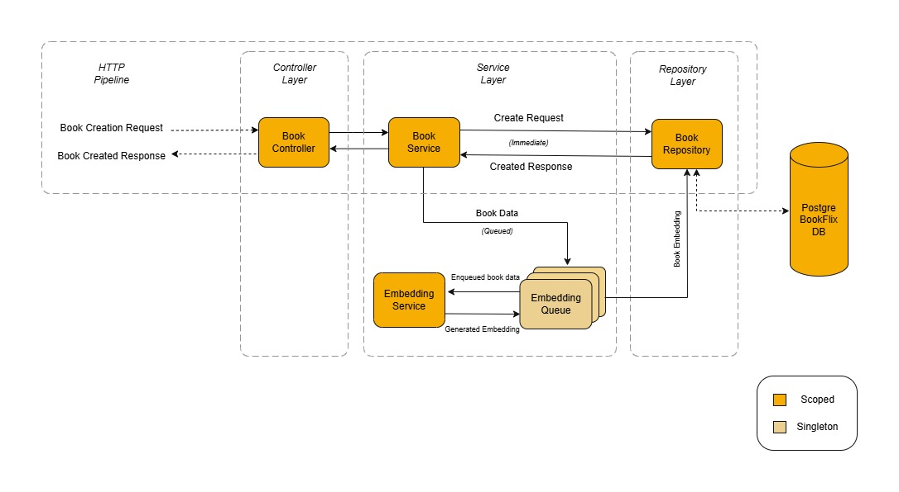
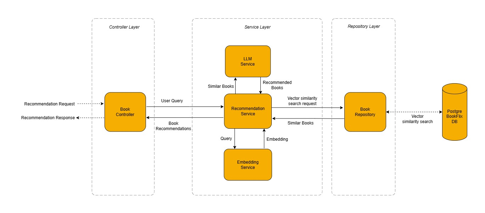

# BookFlix — Intelligent Book Management & Recommendation API

BookFlix is a scalable, AI-enhanced backend platform for intelligent book management and semantic recommendations integrated with Groq LLM — built with ASP.NET Core, PostgreSQL, pgvector. 

  
  
  
<p3>(Animated explanations below)</p3>

## Description

**BookFlix** is a secure, modular, and scalable API-first backend platform built with **ASP.NET Core Web API** and **Entity Framework Core**. It manages books, categories, and ratings with advanced filtering, sorting, and pagination, following scalable software design principles. Featuring robust JWT-based authentication with role-based authorization, clean service-repository separation, and scalable dependency injection, all structured within a maintainable and extensible architecture.  

The project includes intelligent, vector-based AI recommendations using pgvector, powered by the Groq LLM API, coupled with advanced semantic similarity search using pgvector in PostgreSQL. A dedicated Python microservice asynchronously generates embeddings, decoupled via a queue-based pipeline to ensure optimal performance and modularity.

---

## Tech Stack

| Component                  | Technology Used                                              |
|---------------------------|--------------------------------------------------------------|
| Backend Framework         | ASP.NET Core Web API                                         |
| ORM & Databases           | Entity Framework Core, PostgreSQL, SQL Server               |
| Vector Similarity Search  | pgvector (PostgreSQL extension)                             |
| AI/LLM Integration        | Groq LLM API                                                 |
| Authentication & Roles   | ASP.NET Identity, JWT                                        |
| DTO Mapping               | AutoMapper                                                  |
| Embedding Service         | Python (via pythonnet for embedding generation)             |
| Logging & Monitoring      | Serilog                                                     |

---

## Access Control & Public API Endpoints
### Authentication Endpoints

**Database used**: SQL Server 16  
**Purpose**: Handles user identity management, registration, login, and JWT issuance for secure access.  

| HTTP Method | Endpoint           | Description                        | Access         |
|--------|--------------------|------------------------------------|----------------|
| POST   | /api/auth/register | Register new user with roles       | Public         |
| POST   | /api/auth/login    | Login and receive JWT token        | Public         |

### Roles and Permissions Overview

These define access levels for users to enforce role-based authorization across all API operations.  
**Available Roles**: Admin, Writer, Reader 

| Role    | Permissions                                 |
|---------|---------------------------------------------|
| Admin   | Full access to all endpoints                |
| Writer  | Can manage all resources (create, update, delete)   |
| Reader  | Can view books, categories, and ratings     |

### Consumer Endpoints

**Database Used**: PostgreSQL 17  
**Purpose**: Handles client-facing CRUD operations across resources such as Books, Categories, and Ratings. Enforces strict role-based access control for secure API usage.  
**Supported Roles (OverAll)**: Admin, Writer, Reader  

| HTTP Method | Endpoint              | Roles Supported          |
|-------------|------------------------|---------------------------|
| POST        | /api/resource          | Admin, Writer             |
| GET         | /api/resource/{id}     | Admin, Writer, Reader     |
| GET         | /api/resource          | Admin, Writer, Reader     |
| PUT         | /api/resource/{id}     | Admin, Writer             |
| DELETE      | /api/resource/{id}     | Admin, Writer             |

---

## Comprehensive CRUD Endpoint Overview

Below is a consolidated view of all major CRUD endpoints for authentication, books, categories, and ratings. These endpoints enable Create, Read, Update, and Delete (CRUD) functionality with role-based access control for secure interactions.

| Resource     | Action        | HTTP Method | Endpoint                          | Roles Allowed         | Description                                              |
|--------------|---------------|-------------|-----------------------------------|------------------------|----------------------------------------------------------|
| **Auth**     | Register       | POST        | /api/auth/register                | Public                 | Register a new user with assigned role(s).              |
|              | Login          | POST        | /api/auth/login                   | Public                 | Authenticate user and return a JWT token.               |
| **Books**    | Create         | POST        | /api/books                        | Writer, Admin          | Add a new book to the catalog.                          |
|              | Bulk Create    | POST        | /api/books/bulk                   | Writer, Admin          | Insert multiple books in a single request.              |
|              | Read All       | GET         | /api/books                        | Reader, Writer, Admin  | Retrieve all available books with optional filters.     |
|              | Read by ID     | GET         | /api/books/{id}                   | Reader, Writer, Admin  | Fetch a specific book by its unique ID.                 |
|              | Update         | PUT         | /api/books/{id}                   | Writer, Admin          | Modify an existing book’s details.                      |
|              | Delete         | DELETE      | /api/books/{id}                   | Writer, Admin          | Remove a book permanently from the database.            |
|              | Recommend      | POST        | /api/books/recommend              | Reader, Writer, Admin  | Get AI-powered book recommendations.                    |
| **Categories**| Create        | POST        | /api/categories                   | Admin                  | Add a new category for books.                           |
|              | Read All       | GET         | /api/categories                   | Reader, Writer, Admin  | Retrieve a list of all categories.                      |
|              | Read by ID     | GET         | /api/categories/{id}              | Reader, Writer, Admin  | Get details of a specific category by ID.               |
|              | Update         | PUT         | /api/categories/{id}              | Admin                  | Update an existing category.                            |
|              | Delete         | DELETE      | /api/categories/{id}              | Admin                  | Delete a category permanently.                          |
| **Ratings**  | Create         | POST        | /api/ratings                      | Admin                  | Add a new book rating.                                  |
|              | Read All       | GET         | /api/ratings                      | Reader, Writer, Admin  | Fetch all ratings across books.                         |
|              | Read by ID     | GET         | /api/ratings/{id}                 | Reader, Writer, Admin  | View rating details by its ID.                          |
|              | Update         | PUT         | /api/ratings/{id}                 | Admin                  | Modify a rating entry.                                  |
|              | Delete         | DELETE      | /api/ratings/{id}                 | Admin                  | Remove a rating from the system.                        |

### Book Listing Features

BookFlix provides dynamic data operations via filterable, sortable, and pageable endpoints.

- **Filtering:** Filter books by Title or Author.
- **Sorting:** Sort by Title, Author, or Price.
- **Pagination:** Customize with pageNumber and pageSize.
- **Parameter Validation:** Only specific query keys are allowed for safety and predictability.
- **Role-based access:** Access to Endpoints based on roles (Reader, Writer, Admin).

#### Example Request
GET /api/books?filterOn=Title&filterQuery=finance&sortBy=Price&isAscending=true&pageNumber=1&pageSize=10

#### Query Parameters

| Parameter     | Type   | Description                                                                 |
|---------------|--------|-----------------------------------------------------------------------------|
| `filterOn`    | string | Column to apply filter on. Allowed values: `Title`, `Author`.               |
| `filterQuery` | string | Value to match in the specified filter column.                              |
| `sortBy`      | string | Column to sort by. Allowed values: `Title`, `Author`, `Price`.              |
| `isAscending` | bool   | `true` for ascending order, `false` for descending.                         |
| `pageNumber`  | int    | Page number to retrieve (starting from 1).                                  |
| `pageSize`    | int    | Number of records per page (default: 1000, allows large datasets).          |

> ⚠️ Only the above parameters are accepted. Any extra or invalid query keys will result in a `400 Bad Request` with a list of allowed parameters.

---

## Embedding Service Architecture

Embeddings are generated asynchronously via a Python-based microservice integrated into the .NET application. This design ensures that the API remains highly responsive while handling AI workloads efficiently.

### 1. **Book Creation Request:**
- When a client sends a `POST /api/books` request, the book data is passed from the controller to the service layer and saved into the database via the repository layer. A success response is returned immediately without waiting for embedding generation.

### 2. **Queueing for Embedding Generation:** 
- After the book is successfully stored, the `IBookService` enqueues the book data into a singleton `IEmbeddingQueue`, allowing the embedding process to run asynchronously without blocking the API response.

### 3. **Asynchronous Background Execution:** 
- A hosted background service continuously monitors the `IEmbeddingQueue`. Once it detects new book data, it dequeues the request and invokes the embedding generation process.
- The `IEmbeddingService` interacts with a Python module (`embedding_service.py`) via `PythonNet`. It passes the book's textual data (e.g., title and description) to `IEmbeddingService` that returns a 384-dimensional semantic embedding vector.

### 4. **Validation and Embedding Storage:** 
- The returned float array is validated to ensure it has 384 elements. If valid, it is wrapped into a `pgvector.Vector` object suitable for storage in PostgreSQL.
- The generated vector is stored in the PostgreSQL database alongside the book record. These vectors are later used for semantic similarity searches in the recommendation process.

---

## AI-Powered Recommendation Engine Workflow

BookFlix delivers intelligent recommendations through a multi-step, AI-augmented pipeline that blends powerful vector-based similarity search with LLM-driven contextual filtering.

### 1. User Query Initiation
- The user sends a plain-text request like:
 `"Give a book that is related to finance or money."`

### 2. Semantic Query Embedding Generation
- The query is sent to a Python-based microservice using `IEmbeddingService`, where it is converted into a high-dimensional vector for semantic understanding.

### 3. Vector Similarity Search
- The .NET backend uses `pgvector` with PostgreSQL to compare the query vector against stored book vectors, identifying semantically similar books using cosine similarity.

### 4. Top Match Selection with Confidence Filtering
- The system retrieves the top 5 most relevant books, emphasizing high confidence and discarding ambiguous results to improve recommendation quality.

### 5. LLM-Based Filtering and Optimization
- The curated list of the top 5 semantically similar books is passed to `ILLMService`, along with a structured system prompt and the original query.
- The LLM analyzes the context and returns:
  - At most 2 GUIDs (book IDs) that are most relevant.
  - A `<think>` block that explains the model's thought process.

The system uses strict rules in the prompt to ensure consistent output format and accuracy.

### 6. Structured DTO Mapping and Explanation Generation
- The selected book IDs are matched to full book details and wrapped in a `RecommendationsDto` object, which includes:
  - A user-friendly message
  - The recommended books
  - Optional reasoning/explanation from the LLM (if `IsExplanationNeeded` is provided as `true` by the user)

### Example Query
- **Request:** Recommend books related to entrepreneurship and personal finance, preferably under ₹500.  
- **Response:** Returns two curated book recommendations that align with business and finance themes, filtered for affordability and category relevance using semantic search and LLM refinement.  

---

## Book Recommendations – Design Optimizations Summary

The recommendation engine is engineered for speed, accuracy, and scale. This allows the system to deliver highly relevant book suggestions with minimal latency, even across millions of books, through the following optimizations:

- **PostgreSQL + pgvector Integration:** Enables efficient high-dimensional vector similarity search with support for semantic relevance.  
- **HNSW Indexing:** Uses Hierarchical Navigable Small World (HNSW) graphs for sub-millisecond vector search performance, even at scale.  
- **Stateless & Modular Architecture:** Each service is loosely coupled and stateless, allowing seamless horizontal scaling under heavy load.  
- **Offloaded LLM & Embedding Tasks:** All resource-intensive processing, including LLM-based filtering and vector embedding, is handled outside the main API thread—ensuring minimal latency during API calls.  
- **Real-Time Recommendations at Scale:** The engine remains performant and responsive even as the catalog of books grows exponentially.  
- **Strict Prompting Strategy:** Groq LLM is guided with precise rules—returning only valid IDs, limiting to two results, and prioritizing category match. This ensures structured and reliable outputs.  
- **Fallback for No Match Scenarios:** If no high-confidence match is found, the system gracefully responds with a clear, fallback message—avoiding forced or irrelevant suggestions.  
- **Asynchronous Embedding Pipeline:** Embedding generation is fully decoupled and handled in the background using a task queue, boosting throughput without blocking user-facing endpoints.  
  
---

## Performance and Scalability Highlights

- **Modular Architecture:** Follows clean coding practices with separation of controller, service, and repository layers.
- **Role-Based Access Control:** Ensures only authorized users access specific actions.
- **Optimized DTO Usage:** Reduces payload size and boosts performance with AutoMapper.
- **Asynchronous Embedding Pipeline:** Improves throughput and decouples AI logic from core APIs.
- **Logging with Serilog:** Logs API activity to both console and persistent storage.
- **Scalable Storage:** PostgreSQL and SQL Server integration support high data volume and fast access.

---

## QuickStart

### Follow these steps to get BookFlix API up and running locally:

### 1. Clone the Repository
- git clone https://github.com/your-username/BookFlix.git
- cd BookFlix
### 2. Setup Environment Variables
#### Create a .env file at the root of the project with the following keys:

 
<strong>📄 .env Example</strong> (click to expand)

#### #PostgreSQL for Book Catalog
BookFlixConnectionString=Host=localhost;Port=5432;Database=BookFlixDb;Username=your_username;Password=your_password

#### #SQL Server or PostgreSQL for Auth Database
BookFlixAuthDbConnectionString=Server=localhost;Database=BookFlixAuthDb;Trusted_Connection=True;TrustServerCertificate=True

#### #JWT Configuration
JWT_Key=your_super_secret_key  
JWT_Issuer=https://localhost:7164/  
JWT_Audience=https://localhost:7164/  

#### #Python Embedding Service (if using pythonnet)
PythonDLLPath=C:/Path/To/pythonXY.dll  
PythonScriptsFolder=C:/Path/To/BookFlix/Python  

#### #Groq AI Configuration
GroqApiKey=your_groq_api_key  
GroqLLMModel=llama3-8b-instruct  

## 3. Apply Migrations
#### Navigate to the API project directory
- cd BookFlix.API

#### Apply migrations to both databases
- dotnet ef database update --context BookFlixDbContext
- dotnet ef database update --context BookFlixAuthDbContext

## 4. Run the Project
- dotnet run --project BookFlix.API

## 5. Test with Swagger
- Visit: https://localhost:1234/swagger
